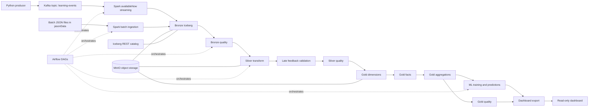

# ALI — Adaptive Learning Intelligence Data Platform

## 1. Project Overview

ALI analyzes learner interactions with AI-assisted learning systems. It detects conceptual weaknesses, repeated mistakes, learner progress, illusion-of-learning gaps, and predicted struggle risk across batch and streaming learning activity.

Business question:

> How can learner interaction history be used to monitor conceptual weaknesses, repeated mistakes, and learning progress over time?

ML question:

> Can real-time learner interaction patterns predict whether a learner is likely to struggle with a specific concept in the near future?

The project demonstrates an end-to-end local data engineering architecture using Kafka, Spark, Iceberg, MinIO, Airflow, data quality gates, Gold modeling, ML scoring, and a read-only learning analytics dashboard.

## 2. Main Capabilities

- Batch ingestion from structured JSON files into Bronze Iceberg tables.
- Kafka streaming ingestion into Bronze with bounded Spark Structured Streaming.
- Bronze, Silver, and Gold Iceberg architecture on MinIO object storage.
- Iceberg REST catalog for table metadata and snapshots.
- Airflow orchestration for setup, ingestion, and processing.
- Bronze and Silver data quality result tables.
- Bronze and Silver quarantine tables for row-level audit copies.
- Late-arriving feedback validation using a 48-hour threshold.
- Silver transformations for learner profiles, question bank, references, learning events, practice attempts, feedback, AI insights, validation, taxonomy, and learner concept evidence.
- Gold dimensions, facts, aggregations, and SCD Type 2 learner dimension.
- ML feature generation, prototype struggle-risk training, and predictions.
- Read-only HTML/CSS/JavaScript dashboard backed by exported aggregate JSON.

## 3. Architecture

No architecture PNG was found in the repository. The implemented architecture is documented with Mermaid diagrams in this README and in [docs/architecture.md](docs/architecture.md).



MinIO stores the physical Iceberg data files. The Iceberg REST catalog manages table metadata and snapshots. Airflow orchestrates Spark jobs by executing `spark-submit` inside the `spark-iceberg` processing container. All Spark and setup Airflow tasks use `spark_iceberg_pool` so local Spark/Iceberg execution is serialized.

## 4. Repository Structure

```text
.
|-- airflow-practice-env/        Airflow orchestration and DAGs
|-- iceberg-practice-env/        Spark, Iceberg, MinIO, jobs, dashboard
|-- kafka-practice-env/          Kafka broker, topic init, producer
|-- jasonData/                   Initial batch/demo JSON inputs
|-- docs/                        Supporting documentation
`-- README.md                    Root project guide
```

Each component has its own Docker Compose configuration and communicates through the shared external Docker network `bigdata-net`.

## 5. Technologies

- Apache Spark and PySpark
- Apache Kafka
- Apache Airflow
- Apache Iceberg
- MinIO
- Iceberg REST Catalog
- Docker Compose
- Python
- Plain HTML/CSS/JavaScript dashboard

Explicit project boundaries:

- No Hive.
- No HDFS.
- Spark applications run only in the processing Spark container, `spark-iceberg`.

## 6. Prerequisites

- Docker Desktop.
- Git.
- A web browser.
- Windows PowerShell or CMD.
- Local Python is only needed if you run the Kafka producer from the host machine. The producer imports `kafka-python`.

Recommended local capacity depends on Docker Desktop settings, but this project starts Kafka, Airflow, PostgreSQL, Redis, Spark, MinIO, and Iceberg REST together. Allocate enough Docker memory for those services to run concurrently.

## 7. Quick Start

### From Windows Project Root

Clone and enter the repository:

```powershell
git clone <repository-url>
cd bigData
```

Create the shared Docker network once:

```powershell
docker network inspect bigdata-net > $null 2>&1; if ($LASTEXITCODE -ne 0) { docker network create bigdata-net }
```

Start the processing/Iceberg environment:

```powershell
docker compose -f iceberg-practice-env/docker-compose.yml up -d
```

Start Kafka:

```powershell
docker compose -f kafka-practice-env/docker-compose.yml up -d
```

Start Airflow:

```powershell
docker compose -f airflow-practice-env/docker-compose.yaml up -d
```

Wait for health checks, then verify containers:

```powershell
docker ps --format "table {{.Names}}\t{{.Status}}\t{{.Ports}}"
```

Open Airflow:

```text
http://localhost:8081
```

Login with the local demo account:

```text
username: airflow
password: airflow
```

Create the shared Spark pool once:

```powershell
docker compose -f airflow-practice-env/docker-compose.yaml exec airflow-apiserver airflow pools set spark_iceberg_pool 1 "Serialize local Spark/Iceberg jobs"
```

Run the environment setup DAG once:

```powershell
docker compose -f airflow-practice-env/docker-compose.yaml exec airflow-apiserver airflow dags trigger ali_environment_setup
```

Run batch ingestion:

```powershell
docker compose -f airflow-practice-env/docker-compose.yaml exec airflow-apiserver airflow dags trigger ali_batch_ingestion
```

For the streaming demo, produce Kafka events from the host if local Python and `kafka-python` are available:

```powershell
python kafka-practice-env/producer/learning_events_producer.py
```

Run or wait for the Kafka ingestion DAG:

```powershell
docker compose -f airflow-practice-env/docker-compose.yaml exec airflow-apiserver airflow dags trigger ali_kafka_ingestion
```

Run the processing pipeline:

```powershell
docker compose -f airflow-practice-env/docker-compose.yaml exec airflow-apiserver airflow dags trigger ali_processing_pipeline
```

Export dashboard data:

```powershell
docker compose -f iceberg-practice-env/docker-compose.yml exec spark-iceberg env -u PYSPARK_DRIVER_PYTHON -u PYSPARK_DRIVER_PYTHON_OPTS /opt/spark/bin/spark-submit /home/iceberg/notebooks/notebooks/jobs/demo/export_dashboard_data_job.py
```

Start the temporary dashboard HTTP server:

```powershell
docker run --rm --name ali-dashboard -p 8090:8090 -v "${PWD}\iceberg-practice-env\notebooks\dashboard:/dashboard" --entrypoint python3 tabulario/spark-iceberg -m http.server 8090 --directory /dashboard --bind 0.0.0.0
```

Open the dashboard:

```text
http://localhost:8090
```

Stop the temporary dashboard server with `Ctrl+C`.

### Component Directory Alternatives

From `iceberg-practice-env`:

```powershell
docker compose up -d
docker compose exec spark-iceberg env -u PYSPARK_DRIVER_PYTHON -u PYSPARK_DRIVER_PYTHON_OPTS /opt/spark/bin/spark-submit /home/iceberg/notebooks/notebooks/jobs/demo/export_dashboard_data_job.py
docker run --rm --name ali-dashboard -p 8090:8090 -v "${PWD}\notebooks\dashboard:/dashboard" --entrypoint python3 tabulario/spark-iceberg -m http.server 8090 --directory /dashboard --bind 0.0.0.0
```

From `kafka-practice-env`:

```powershell
docker compose up -d
python producer/learning_events_producer.py
```

From `airflow-practice-env`:

```powershell
docker compose up -d
docker compose exec airflow-apiserver airflow pools set spark_iceberg_pool 1 "Serialize local Spark/Iceberg jobs"
docker compose exec airflow-apiserver airflow dags trigger ali_environment_setup
```

## 8. Service URLs And Credentials

| Service | URL or endpoint | Demo credentials |
|---|---|---|
| Airflow | `http://localhost:8081` | `airflow` / `airflow` |
| JupyterLab | `http://localhost:8888` | Token may be printed in `spark-iceberg` logs |
| MinIO Console | `http://localhost:9001` | `admin` / `password` |
| MinIO S3 API | `http://localhost:9000` | local demo credentials in Compose |
| Spark UI | `http://localhost:8080` | none |
| Iceberg REST | `http://localhost:8181` | none |
| Kafka external broker | `localhost:9092` | none |
| Kafka internal broker | `kafka:29092` | none |
| Dashboard | `http://localhost:8090` | none |

The repository includes local demo credentials in Docker Compose configuration. Do not use them outside this local project.

## 9. Airflow DAGs

### ali_environment_setup

- Schedule: `None`.
- Manual-only setup DAG.
- Tasks: `setup_namespaces`, `setup_bronze_tables`, `setup_quality_tables`, `setup_silver_tables`, `setup_gold_tables`, `setup_ml_tables`, `setup_runtime_paths`.
- Creates/verifies namespaces, Iceberg tables, and runtime paths using idempotent setup jobs.

### ali_batch_ingestion

- Schedule: `0 1 * * *`.
- Runs daily at 01:00 Asia/Jerusalem.
- Task: `bronze_batch`.
- Loads batch JSON sources into Bronze.

### ali_kafka_ingestion

- Schedule: `*/5 * * * *`.
- Runs every 5 minutes.
- Task: `kafka_to_bronze_streaming`.
- Uses bounded Spark Structured Streaming with `availableNow` behavior to drain currently available Kafka events.

### ali_processing_pipeline

- Schedule: `15 * * * *`.
- Runs once per hour at minute 15, for example 01:15, 02:15, 03:15.
- Dependency chain:

```text
bronze_quality
-> silver_transform
-> late_arriving_feedback
-> silver_quality
-> gold_dimensions
-> gold_facts
-> gold_aggregations
-> gold_quality
-> ml_training
```

All four DAGs use `catchup=False` and `max_active_runs=1`. All Spark and setup tasks use the Airflow pool `spark_iceberg_pool`. The pool should have one slot to prevent concurrent local Spark/Iceberg execution.

## 10. Data Sources

Implemented sources:

- Streaming AI learning events from `kafka-practice-env/producer/learning_events_producer.py`.
- Batch question bank from `jasonData/question_bank.json`.
- Batch reference materials from `jasonData/reference_materials.json`.
- Learner profiles from `jasonData/learner_profiles.json`.
- Learning events from `jasonData/learning_events_final.json`.
- Pre-practice, post-practice, general check-in, and late-arriving feedback from `jasonData/learning_feedback.json`.

The batch sources are structured JSON files mounted into the Spark container at `/home/iceberg/notebooks/jasonData`.

## 11. Data Architecture

### Bronze

Bronze stores raw ingested records with ingestion metadata and `raw_payload` for traceability.

### Silver

Silver stores cleaned and normalized tables with stable business grains: learner profiles, question bank, references, AI learning events, practice attempts, feedback, AI insights, validation, content taxonomy, and learner concept evidence.

The Silver evidence ledger stores learner observations as source-grounded events. It is separate from calculated Gold learner concept state.

### Gold

Gold stores dimensions, facts, aggregations, ML features, ML training rows, and ML predictions. Gold tables are designed for analytics and dashboard access.

## 12. Data Model

Gold dimensions:

- `demo.gold.dim_learner`
- `demo.gold.dim_topic`
- `demo.gold.dim_content_type`
- `demo.gold.dim_reference_source`

Gold facts:

- `demo.gold.fact_learning_interaction`: one row per learning event.
- `demo.gold.fact_practice_attempt`: one row per practice attempt.
- `demo.gold.fact_learning_session`: one row per learner session.
- `demo.gold.fact_learning_feedback`: one row per feedback record.
- `demo.gold.fact_ai_insight_validation`: one row per validated AI insight/reference match.
- `demo.gold.fact_learner_concept_state`: one row per learner, concept, and state version.

Gold aggregations:

- `demo.gold.agg_learner_overview_daily`
- `demo.gold.agg_concept_weakness_daily`
- `demo.gold.agg_learning_progress_daily`
- `demo.gold.agg_illusion_of_learning`

ML tables:

- `demo.gold.ml_learning_difficulty_features`
- `demo.gold.ml_learning_difficulty_training`
- `demo.gold.ml_learning_difficulty_predictions`

`demo.gold.dim_learner` implements SCD Type 2 using `valid_from`, `valid_to`, and `is_current`. More detail is in [docs/data-model.md](docs/data-model.md).

## 13. Late-Arriving Data

Late-arriving feedback is validated with a 48-hour rule. The job compares `feedback_time` and `ingestion_time`:

```text
delay_hours = (unix_timestamp(ingestion_time) - unix_timestamp(feedback_time)) / 3600
```

Rows with delay up to 48 hours are `ACCEPTED`. Rows over 48 hours are `TOO_LATE`. The validation job checks that accepted feedback exists in its expected Silver feedback table and that too-late feedback was not routed into a normal Silver destination.

Expected feedback routing:

- `before_practice` -> `demo.silver.pre_practice_feedback`
- `after_practice` -> `demo.silver.post_practice_feedback`
- `general_check_in` -> `demo.silver.learner_check_in`

The late-arriving feedback job is validation-only. It does not delete or modify violating rows.

## 14. Data Quality And Reliability

Implemented quality tables:

- `demo.quality.bronze_quality_results`
- `demo.quality.bronze_quarantine`
- `demo.quality.silver_quality_results`
- `demo.quality.silver_quarantine`

Bronze and Silver quality jobs write rule-level results with `PASS`, `WARNING`, and `FAIL` statuses. Row-level invalid records are copied into quarantine tables with source table, record id, failed rule, severity, failure reason, raw record, optional raw payload, and quarantine status.

Downstream transformations read quarantine tables and filter unresolved `OPEN` quarantine records from normal processing. Source records remain auditable. Handled invalid rows do not stop the pipeline by themselves, while systemic job failures and nonzero validation gates are propagated to Airflow.

The dashboard quality summary reads Bronze and Silver quality results plus quarantine counts. Gold quality results are not persisted as a table in the current implementation.

## 15. Machine Learning

Gold aggregations produce point-in-time ML features in `demo.gold.ml_learning_difficulty_features`. The ML job builds prototype training rows, trains a Spark ML decision tree classifier, saves a uniquely versioned model directory, and writes predictions to `demo.gold.ml_learning_difficulty_predictions`.

The label is struggle risk for a learner/topic/session based on practice outcome. Dashboard risk views use the latest prediction per `user_key`, `topic_key`, and `session_id`, ordered by `prediction_created_at` descending, to avoid counting duplicate historical predictions for the same learner-topic-session.

This is a local prototype model for demonstrating data engineering and scoring flow, not a production-grade predictive model.

## 16. Dashboard

The dashboard is read-only. It uses:

- Export job: `iceberg-practice-env/notebooks/jobs/demo/export_dashboard_data_job.py`
- JSON output: `iceberg-practice-env/notebooks/dashboard/data/dashboard_data.json`
- Static files: `iceberg-practice-env/notebooks/dashboard/index.html`, `styles.css`, `dashboard.js`

The export job reads Gold, Quality, and ML tables and writes dashboard JSON. It does not write Iceberg tables.

Export data:

```powershell
docker compose -f iceberg-practice-env/docker-compose.yml exec spark-iceberg env -u PYSPARK_DRIVER_PYTHON -u PYSPARK_DRIVER_PYTHON_OPTS /opt/spark/bin/spark-submit /home/iceberg/notebooks/notebooks/jobs/demo/export_dashboard_data_job.py
```

Serve the dashboard:

```powershell
docker run --rm --name ali-dashboard -p 8090:8090 -v "${PWD}\iceberg-practice-env\notebooks\dashboard:/dashboard" --entrypoint python3 tabulario/spark-iceberg -m http.server 8090 --directory /dashboard --bind 0.0.0.0
```

Open:

```text
http://localhost:8090
```

Stop the server with `Ctrl+C`. Refresh dashboard data by rerunning the export job and refreshing the browser.

Current dashboard sections:

- KPI cards
- Weakest concepts
- Learning progress
- ML risk
- Evidence gap
- Quality
- Pipeline status

## 17. End-to-End Demo

Use [docs/demo-guide.md](docs/demo-guide.md) for a no-cut recording script.

Concise sequence:

1. Show containers with `docker ps`.
2. Open Airflow at `http://localhost:8081`.
3. Trigger `ali_environment_setup` once if the environment is new.
4. Trigger `ali_batch_ingestion`.
5. Run the Python Kafka producer.
6. Show Kafka messages from `learning-events`.
7. Trigger or wait for `ali_kafka_ingestion`.
8. Trigger `ali_processing_pipeline`.
9. Inspect Bronze, Silver, Gold, Quality, and ML tables.
10. Export dashboard data.
11. Start the temporary dashboard server.
12. Open `http://localhost:8090`.

## 18. Idempotency And Reliability

Operational jobs are built around deterministic identifiers and MERGE-based writes. Repeated execution refreshes existing rows instead of blindly appending duplicates. Quality jobs generate deterministic result and quarantine identifiers. Airflow uses `max_active_runs=1` per DAG and a shared one-slot `spark_iceberg_pool` across setup, ingestion, Kafka draining, and processing.

Kafka ingestion is bounded through available-now streaming so each DAG run drains the currently available messages and exits. Nonzero job exit codes propagate back to Airflow task failures.

## 19. Troubleshooting

See [docs/troubleshooting.md](docs/troubleshooting.md). Common checks:

```powershell
docker network inspect bigdata-net
docker ps --format "table {{.Names}}\t{{.Status}}\t{{.Ports}}"
docker compose -f airflow-practice-env/docker-compose.yaml logs airflow-scheduler
docker compose -f iceberg-practice-env/docker-compose.yml logs spark-iceberg
docker compose -f kafka-practice-env/docker-compose.yml logs kafka
```

## 20. Shutdown And Cleanup

Stop the dashboard server with `Ctrl+C`.

Stop services while preserving data:

```powershell
docker compose -f airflow-practice-env/docker-compose.yaml down
docker compose -f kafka-practice-env/docker-compose.yml down
docker compose -f iceberg-practice-env/docker-compose.yml down
```

The normal `down` commands remove containers and networks created by each Compose project while preserving named volumes and the Iceberg warehouse bind mount.

Optional destructive cleanup:

```powershell
docker compose -f airflow-practice-env/docker-compose.yaml down -v
docker compose -f kafka-practice-env/docker-compose.yml down -v
docker compose -f iceberg-practice-env/docker-compose.yml down -v
```

The `-v` option removes Compose-managed volumes such as Airflow metadata and Kafka broker data. Iceberg table files are stored under the repository's `iceberg-practice-env/warehouse` bind mount and are not removed by the Kafka or Airflow cleanup commands.

## 21. Known Prototype Limitations

- Small synthetic demo dataset.
- Rule-based insight/reference validation.
- No true vector semantic retrieval.
- Limited taxonomy normalization.
- No Great Expectations integration.
- No DataHub integration.
- Local single-slot Spark serialization rather than distributed cluster scheduling.
- Static dashboard refreshed through an export job.

## 22. Authors

Eden Lagziel
