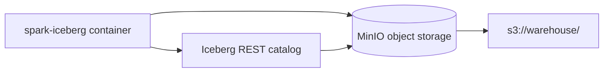
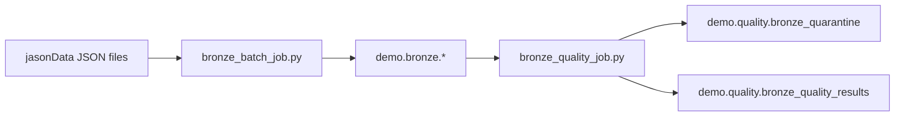
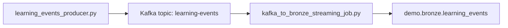
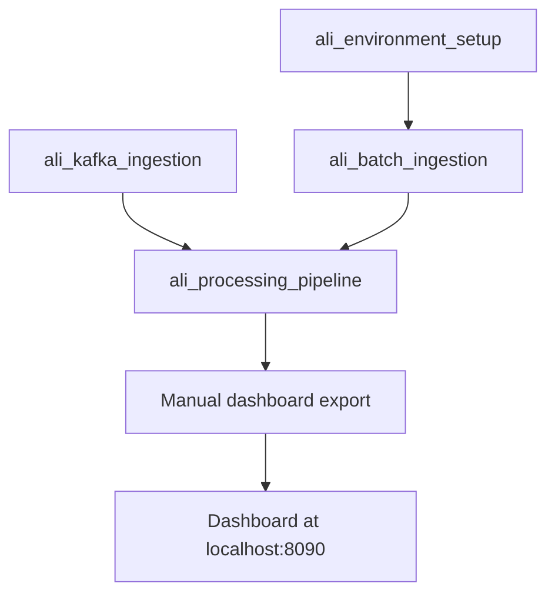
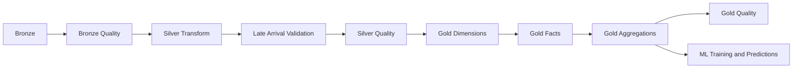
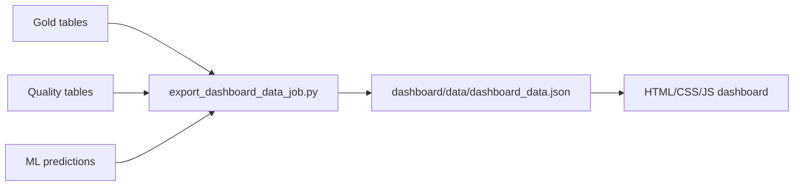

# Architecture

ALI is split into three local Docker Compose environments that communicate through the shared external Docker network `bigdata-net`.

| Directory | Role | Compose file |
|---|---|---|
| `iceberg-practice-env` | Spark processing, JupyterLab, Iceberg REST, MinIO, dashboard files | `docker-compose.yml` |
| `kafka-practice-env` | Kafka broker, topic initialization, learning event producer | `docker-compose.yml` |
| `airflow-practice-env` | Airflow orchestration with Docker SDK execution | `docker-compose.yaml` |

## Component Responsibilities

- `spark-iceberg`: runs all Spark applications and exposes JupyterLab.
- `iceberg-rest`: serves the Iceberg REST catalog.
- `minio`: stores Iceberg data files.
- `mc`: initializes the local MinIO warehouse bucket.
- `kafka`: hosts the `learning-events` topic.
- `kafka-init`: creates the Kafka topic if it does not exist.
- `airflow-apiserver`, `airflow-scheduler`, `airflow-dag-processor`, `airflow-worker`, `airflow-triggerer`: run Airflow.
- `postgres`: Airflow metadata database.
- `redis`: Airflow Celery broker.

## Storage And Catalog Separation

Iceberg table data is stored physically in MinIO. Iceberg metadata and snapshots are coordinated through the Iceberg REST catalog. Spark jobs talk to the catalog and storage from inside the `spark-iceberg` container.

## Batch Flow

Batch input files:

- `jasonData/learner_profiles.json`
- `jasonData/question_bank.json`
- `jasonData/reference_materials.json`
- `jasonData/learning_events_final.json`
- `jasonData/learning_feedback.json`

## Streaming Flow

The active producer emits `event_type = "practice_submitted"` events to Kafka at `localhost:9092`. Spark reads Kafka inside Docker through `kafka:29092`. The Kafka ingestion DAG runs every five minutes and the Spark job uses bounded available-now behavior.

## Orchestration Flow

Current DAGs:

- `ali_environment_setup`: manual setup of namespaces, tables, and runtime paths.
- `ali_batch_ingestion`: daily batch load at 01:00 Asia/Jerusalem.
- `ali_kafka_ingestion`: bounded Kafka drain every five minutes.
- `ali_processing_pipeline`: hourly processing at minute 15.

All Spark and setup tasks use `spark_iceberg_pool`. Configure it with one slot in Airflow to serialize local Spark execution.

## Processing Flow

Quality gates write results and quarantine rows. Downstream jobs filter unresolved quarantined source rows before writing curated Silver and Gold outputs.

## Dashboard Flow

The dashboard is static and read-only. It displays real exported aggregate/demo-safe data from Gold, Quality, and ML outputs.

