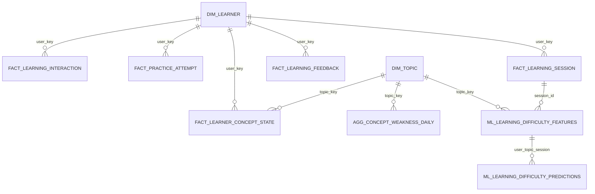
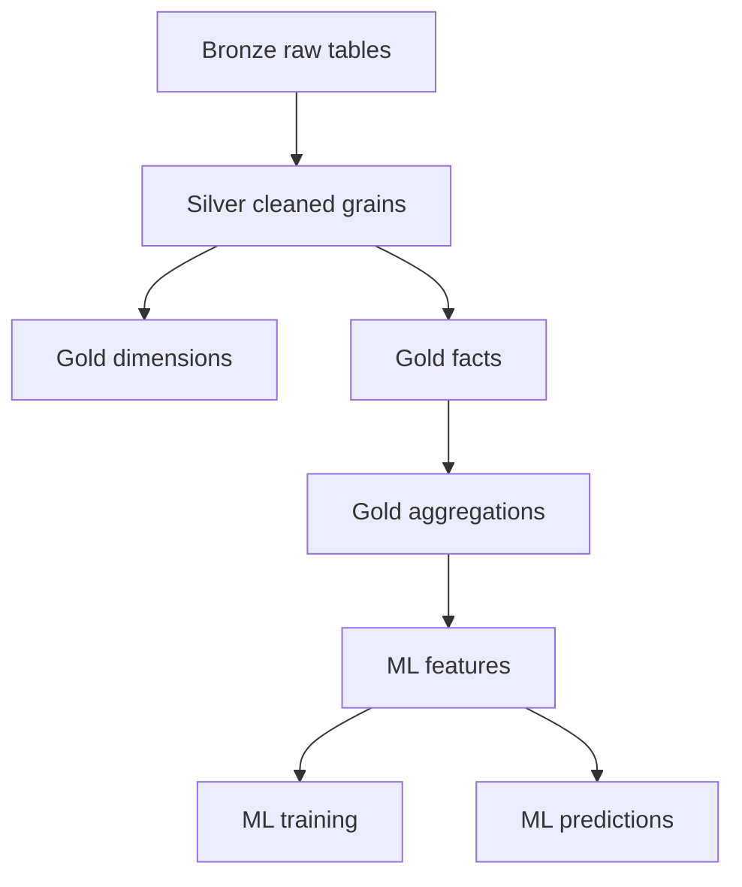

# Data Model

ALI uses Bronze, Silver, and Gold Iceberg tables in the `demo` catalog. Setup jobs create the table definitions under `iceberg-practice-env/notebooks/jobs/setup/`.

## Namespaces

- `demo.bronze`
- `demo.silver`
- `demo.gold`
- `demo.quality`

## Bronze Tables

| Table | Purpose |
|---|---|
| `demo.bronze.learning_events` | Raw batch and Kafka learning events |
| `demo.bronze.learning_feedback` | Raw feedback, check-ins, and late-arriving feedback |
| `demo.bronze.reference_materials` | Raw reference content |
| `demo.bronze.question_bank` | Raw question definitions |
| `demo.bronze.learner_profiles` | Raw learner profile records |

Bronze tables retain raw payloads and ingestion metadata for traceability.

## Silver Tables

| Table | Grain |
|---|---|
| `demo.silver.learner_profiles` | Learner profile version |
| `demo.silver.question_bank` | Question id and version |
| `demo.silver.reference_materials` | Reference material |
| `demo.silver.learning_events` | AI learning interaction event |
| `demo.silver.practice_attempts` | Practice submitted attempt |
| `demo.silver.pre_practice_feedback` | Pre-practice feedback record |
| `demo.silver.post_practice_feedback` | Post-practice feedback record |
| `demo.silver.learner_check_in` | General learner check-in |
| `demo.silver.learner_check_in_topics` | Check-in topic detail |
| `demo.silver.ai_extracted_insights` | AI-extracted learner insight |
| `demo.silver.validated_learning_insights` | Current selected reference validation per insight |
| `demo.silver.content_taxonomy` | Current taxonomy node |
| `demo.silver.learner_concept_evidence` | Learner concept evidence event |

Silver separates observations from derived state. `learner_concept_evidence` is an event ledger. It preserves evidence identity and source-event time. Calculated mastery and evolving learner state are modeled in Gold.

## Gold Dimensions

| Table | Grain | Notes |
|---|---|---|
| `demo.gold.dim_learner` | Learner profile version | SCD Type 2 with `valid_from`, `valid_to`, `is_current` |
| `demo.gold.dim_topic` | Taxonomy node | Built from current Silver taxonomy |
| `demo.gold.dim_content_type` | Content type | Deterministic content-type dimension |
| `demo.gold.dim_reference_source` | Reference source | Built from Silver reference materials |

`dim_learner` preserves learner history. The current row has `is_current = true`; previous versions have a closed `valid_to`.

## Gold Facts

| Table | Grain |
|---|---|
| `demo.gold.fact_learning_interaction` | One row per learning event |
| `demo.gold.fact_practice_attempt` | One row per practice attempt |
| `demo.gold.fact_learning_session` | One row per `session_id` and `user_key` |
| `demo.gold.fact_learning_feedback` | One row per feedback record |
| `demo.gold.fact_ai_insight_validation` | One row per validation |
| `demo.gold.fact_learner_concept_state` | One row per learner, topic, and state version |

Fact joins use current `dim_learner` rows for analytic identity while `dim_learner` itself retains SCD2 profile history.

## Gold Aggregations

| Table | Grain |
|---|---|
| `demo.gold.agg_learner_overview_daily` | `user_key`, `date` |
| `demo.gold.agg_concept_weakness_daily` | `user_key`, `topic_key`, `date` |
| `demo.gold.agg_learning_progress_daily` | `user_key`, `date` |
| `demo.gold.agg_illusion_of_learning` | `user_key`, `topic_key`, `session_id` |

Aggregations support dashboard trends, weakest-concept ranking, learner progress summaries, illusion-of-learning gaps, and ML feature generation.

## ML Tables

| Table | Grain |
|---|---|
| `demo.gold.ml_learning_difficulty_features` | `user_key`, `topic_key`, `session_id` |
| `demo.gold.ml_learning_difficulty_training` | `user_key`, `topic_key`, `session_id` |
| `demo.gold.ml_learning_difficulty_predictions` | `user_key`, `topic_key`, `session_id`, `model_version` |

Predictions are versioned by model. The dashboard chooses the latest prediction per `user_key`, `topic_key`, and `session_id` before aggregating risk.

## Relationship Diagram

## Layer Flow

